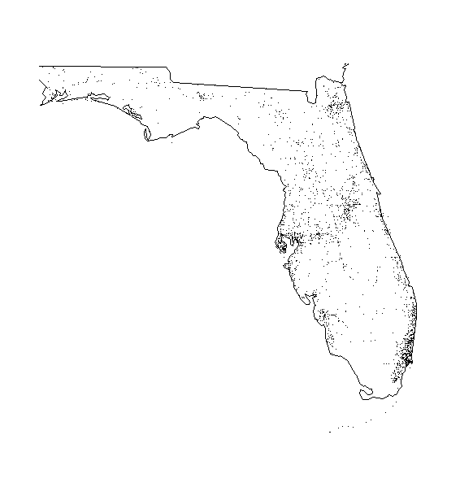

The package `myAssignment` contains a collection of functions that can be used to explore and visualize data sets from the Fatality Analysis Reporting System (FARS) provided by the United States Department of Transportation.

It includes 5 functions, in short

- `fars_read` to load a data set from hard disk
- `make_filename` to create the file name for a data set from a year number
- `fars_read_years` to read multiple data sets from hard disk
- `fars_summarize_years` to summarize incidents per year and month
- `fars_map_state` to visualize the locations of the incidents in a given US

## Function Details

The package provides documentation for each of the functions. If you would like to know more about a function's usage, use `help(<function_name>)`. In this section we provide a steep introduction to exploring FARS data using the provided functions.

### fars_read

FARS data sets have been provided by the teachers of the Coursera course "Building R Packages" as compressed comma-separated value (CSV) files. These files are named `accident_<year>.csv.bz2`, where `<year>` is the number of a specific year.

The function `fars_read` reads a CSV file from the current working directory into an R `data frame tbl`, given that a file with the given name exists.

### make_filename

Because the file names of the provided FARS datasets are a handful to type, you can create the file name with the above naming scheme automatically.

The function `make_filename` takes the number of a year and concstructs the proper file name from it. For example, calling `make_filename(2017)` would return the string `accident_2017.csv.bz2`. The file doesn't have to exist in order to create its name. It *does* have to exist if you want to load it using, for example, `fars_read`.

### fars_read_years

The FARS data sets contain accidents as observations. Each accident occurs in a given month. The year of the accident is not part of the observation. It can be inferred from the data set, however, because each data set contains only accidents of one year.

The function `fars_read_years` gives you an overview over how many accidents have occurred in each month of a given year. You pass a vector of year numbers to this function. It then creates the file names using `make_filename` and loads the respective data sets from the current working directory (provided *all* the files exist). Finally, the function creates a list of data frames, each containing two columns `MONTH` and `year`. The column `year` will contain the respective year. The column `MONTH` contains the number of the month in which each accident occurred (1 = Jan, 2 = Feb, etc.).

### fars_summarize_years

Since the function `fars_read_years` loses a lot of the information contained in the original data sets, the use of its output is very limited. One obvious application would be to count the number of rows for each year and each month.

The function `fars_summarize_years` does just that automatically. Again, you pass a vector of year numbers to it. It calls `fars_read_years` with that vector, creating the list described in the previous section. Then it pastes all the data frames in that list into one data frame and counts the accidents per year and month. The result is a data frame with 12 rows (one for each month) and a number of columns equal to the number of years you gave. Each cell contains the number of accidents that occurred during the respective month of each year.

### fars_map_state

Sometimes it's useful to visualize a data set. A number of visualizations are commonplace and can be obtained easily. One of the most attractive visualizations is geographical data.

The function `fars_map_state` plots each accident of a given year as a dot on the map of the US state in which it occurred. You pass to this function the number of a US state and the number of a year. Plotting the map is a *side effect* of the function. It does not return any value. I.e. the return value of this function is `NULL`. Here's an example of the plot generated by calling `fars_map_state(12, 2014)`. It plots the accidents which occurred in the state of Florida (see "[Appendix: State Numbers](#apdsn)") during 2014.

##  Appendix: State Numbers

The FARS data set uses numbers ranging from 1 to 56 to encode the US state in which an accident occurred. The numbers are mapped to states in alphabetical order. Here's a table in which you can look up the number of each state. Extensive information on the data sets provided by FARS can be found online in this [PDF Document](https://crashstats.nhtsa.dot.gov/Api/Public/Publication/812315).

STATE number    | State    | STATE number    | State
----------------|----------|-----------------|------
01 | Alabama | 31 | Nebraska
02 | Alaska | 32 | Nevada
04 | Arizona | 33 | New Hampshire
05 | Arkansas | 34 | New Jersey
06 | California | 35 | New Mexico
08 | Colorado | 36 | New York
09 | Connecticut | 37 | North Carolina
10 | Delaware | 38 | North Dakota
11 | District of Columbia | 39 | Ohio
12 | Florida | 40 | Oklahoma
13 | Georgia | 41 | Oregon
15 | Hawaii | 42 | Pennsylvania
16 | Idaho | 43 | Puerto Rico
17 | Illinois | 44 | Rhode Island
18 | Indiana | 45 | South Carolina
19 | Iowa | 46 | South Dakota
20 | Kansas | 47 | Tennessee
21 | Kentucky | 48 | Texas
22 | Louisiana | 49 | Utah
23 | Maine | 50 | Vermont
24 | Maryland | 52 | Virgin Islands (since 2004)
25 | Massachusetts | 51 | Virginia
26 | Michigan | 53 | Washington
27 | Minnesota | 54 | West Virginia
28 | Mississippi | 55 | Wisconsin
29 | Missouri | 56 | Wyoming
30 | Montana | | 
